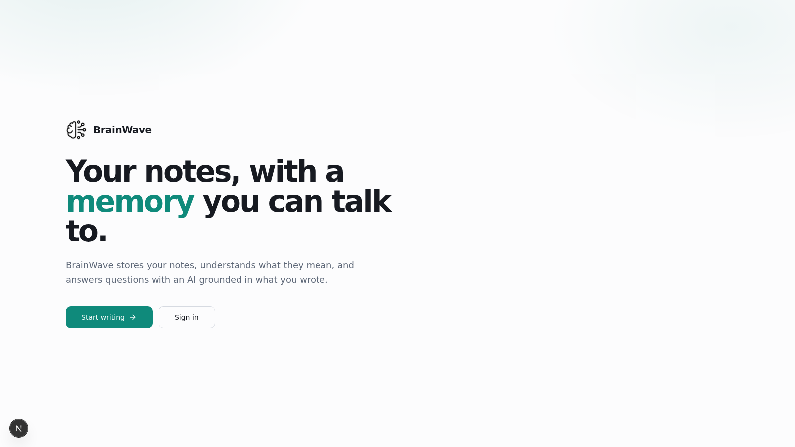

# BrainWave — AI Note-Taking App

An AI-powered note-taking app. Create and manage notes, then chat with an AI
assistant that answers questions grounded in **your own notes** via local
semantic search (RAG).



## Screenshots

| Landing page | Notes + AI chat |
| --- | --- |
|  |  |

## Features

- 📝 Full note CRUD (create, edit, delete) with per-user auth via Clerk
- 🤖 AI chat that retrieves your most relevant notes using embeddings and
  answers questions based on them
- 🔒 Notes are private per user; retrieval is always scoped to the signed-in user
- 🌗 Dark mode

## Tech Stack

- **Framework:** Next.js (App Router) + React + TypeScript
- **Styling:** Tailwind CSS + shadcn/ui
- **Auth:** Clerk
- **Database:** SQLite via Prisma ORM
- **Embeddings:** [`@huggingface/transformers`](https://huggingface.co/docs/transformers.js)
  running locally (`Xenova/bge-small-en-v1.5`, 384-dim) — no external API
- **Semantic search:** In-database vector storage with cosine similarity scoring
- **Chat model:** `openai/gpt-oss-20b` served free by [Groq](https://groq.com),
  streamed via the Vercel AI SDK

No paid API keys are required to run this project.

## Getting Started

```bash
npm install
cp .env.example .env.local   # fill in GROQ_API_KEY + Clerk keys
npx prisma db push           # create the SQLite database
npm run dev
```

Open [http://localhost:3000](http://localhost:3000).

## How the AI chat works

1. The last few chat messages are embedded locally.
2. Your notes are scored against the query with cosine similarity.
3. The top 4 matching notes are injected into the system prompt.
4. Groq streams a grounded answer back to the UI.

## Deployment

Deploys as a standard Next.js app (e.g. Vercel). Set the environment variables
from `.env.example` in your hosting provider's dashboard. On serverless hosts,
point `DATABASE_URL` at a persistent volume, or swap the datasource for a
hosted database of your choice.
